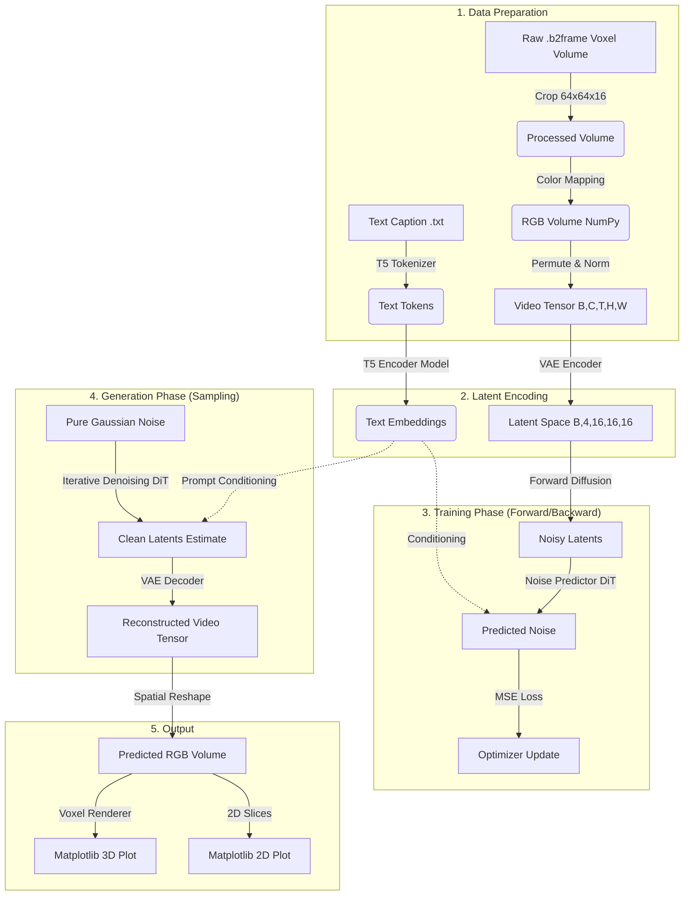

# LongSANA Pipeline Architecture

This document details the data flow and model architecture implemented in the `tiny_diffusion_prototype.ipynb`.

## Data Flow Diagram

The following diagram illustrates the transformation of raw Minecraft voxel data into a generated 3D structure.

## Step-by-Step Breakdown

### 1. Data Preparation
- **Voxel Volume:** Loaded from `.b2frame` (Blosc2) files.
- **Cropping:** Aggressively reduced to `64x64x16` to fit local VRAM (Blackwell compatible).
- **Color Mapping:** Converts raw block IDs to normalized RGB values.
- **Formatting:** Reshapes data into `(B, C, T, H, W)`, effectively treating the vertical axis as the "time" dimension for video diffusion layers.

### 2. Latent Encoding (VAE)
- Uses a **3D Variational Autoencoder** (Trainable) to compress the spatial dimensions.
- The high-resolution Grid is reduced to a compact latent representation, lowering the computational cost for the Diffusion Transformer.

### 3. Text Conditioning
- **T5 Encoder:** Processes the caption (e.g., "A simple stone castle tower") into high-dimensional semantic embeddings.
- These embeddings guide the denoising process to ensure the output matches the user's intent.

### 4. Diffusion Transformer (DiT)
- A **3D Convolutional Block** acts as the noise predictor.
- It learns to estimate the noise added to a latent sample at a specific timestep, conditioned on the text.

### 5. 3D Visualization
- Final output is decoded via the VAE Decoder.
- A custom **Voxel Renderer** uses Matplotlib's `voxels` method to display the 3D structure, allowing for physical verification of the generated geometry.
